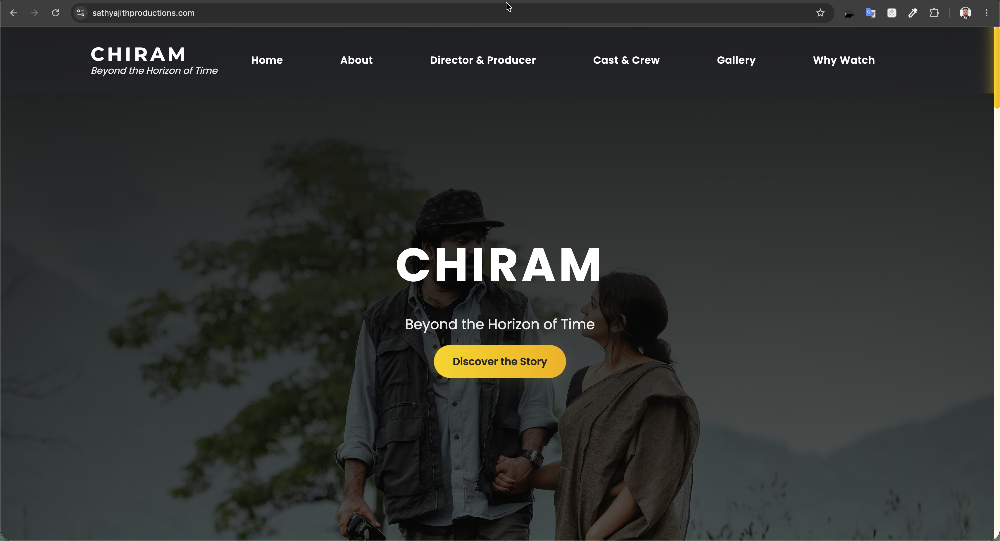

# 🎬 Chiram Movie Website

A modern and responsive React-based website developed for the **Chiram Movie Project**, providing visitors with comprehensive information about the film, including its cast, crew, production team, gallery, and more. The website offers an engaging user experience with smooth navigation, multilingual support, and interactive UI components.

---

## ✨ Features

- 🎬 Beautiful landing page introducing the movie
- 📱 Fully responsive design for desktop, tablet, and mobile devices
- 🌐 Multi-language support
- 🖼️ Gallery showcasing movie images and promotional media
- 👥 Dedicated profile pages for cast, crew, and production team
- 🖱️ Smooth scrolling navigation between sections
- ⚡ Interactive and modern user interface
- 🔗 Client-side routing using React Router
- 🎨 Clean and visually appealing design

---

## 🛠 Tech Stack

| Category | Technology |
|----------|------------|
| Frontend | React 18 |
| Routing | React Router v6 |
| Smooth Navigation | React Router Hash Link |
| Icons | React Icons |
| Styling | CSS3 |

---

## 📸 Screenshots

| Home Page |
|:---------:|
|  |

---

## 🚀 Future Enhancements

- 🎥 Trailer integration
- 📅 Event and release updates
- 📹 Behind-the-scenes section
- 📰 News and announcements
- 🎵 Background soundtrack integration

---
